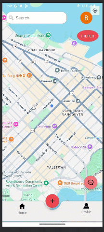
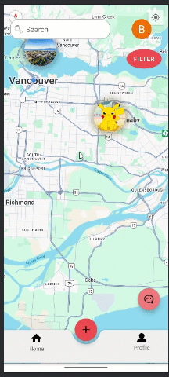
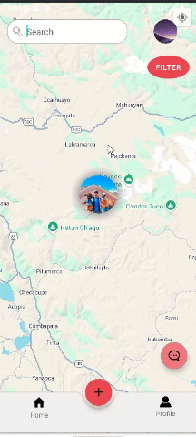
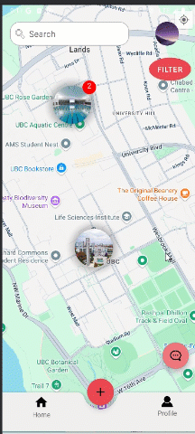
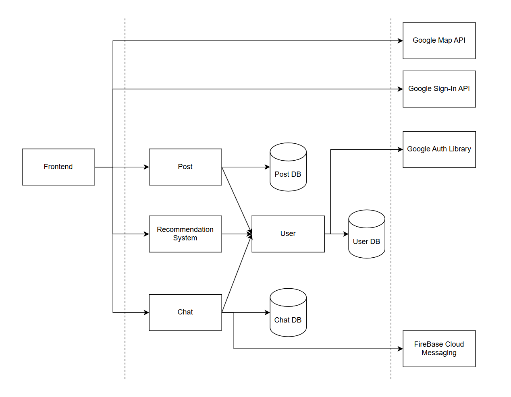

# 🍅 ToMATo
---
[](https://codecov.io/gh/BryanTanady/Tomato)

> **TOMATo** (**T**ravellers **o**n **M**aking **A**dventures **To**gether) is a social travel journal: drop photo-backed pins on a map, keep a personal log of everywhere you’ve been, and get location recommendations from people who travel like you. Chat with them for on-the-ground tips.

---


## ✨ Core Features

### 📍 Interactive Map (Portfolio Pitch)

* Map‑first experience: browse a world of photo pins at a glance.
* See **your private pins** alongside **the community’s public pins** (clearly labeled/toggleable).
* Smart clustering keeps the view clean; dense areas collapse into tappable clusters so nothing gets buried.
<p align="center">
    
</p>

### 🔎 Search Locations

* Global search bar to jump the camera anywhere on Earth.
* **Autocomplete** suggests places as you type for instant navigation.
<p align="center">
    
</p>

### 📝 Post Management

* Create posts with photo + description + privacy flag (public/private).
* Delete posts you no longer want.
* View full post details from any pin.

<p align="center">
    
</p>


### 🤝 Chat

* Start a conversation directly from someone else’s post (“Send Message”).
* Or open the Chat screen to start new threads / browse existing ones.
* Push notifications (FCM) for new messages.

<p align="center">
    
</p>

### 🧠 Recommendations

* Personalized location suggestions based on *similar users’* travel histories (not just proximity).
* Displayed in a dedicated **Profile → Recommendations** section for clean separation from map filters.

<p align="center">
    
</p>

---

## 🛠 Tech Stack

* **Frontend**: Kotlin + Google Maps SDK
* **Backend**: TypeScript / Express.js on AWS EC2
* **Auth**: GGoogle Sign-In on client → JWT issued/verified by backend
* **Notification**: Firebase Cloud Messaging (FCM)
* **Database**: MongoDB
* **Testing**:  
  * **Backend**: Jest (TypeScript)  
  * **Frontend**: Espresso (Android UI tests) 


---

## 🧩 Architecture Overview

<p align="center">
    
</p>


---

## 🧭 Getting Started (Dev)

```bash
# Backend
npm install
npx ts-node index.ts 

# Frontend (Android/Web)
# Configure Google Maps + Sign-In keys
# Run the app via Android Studio / Vite / your chosen stack
```

* Set environment vars for Google OAuth verification.
* Firebase project setup for FCM (notification).
---
