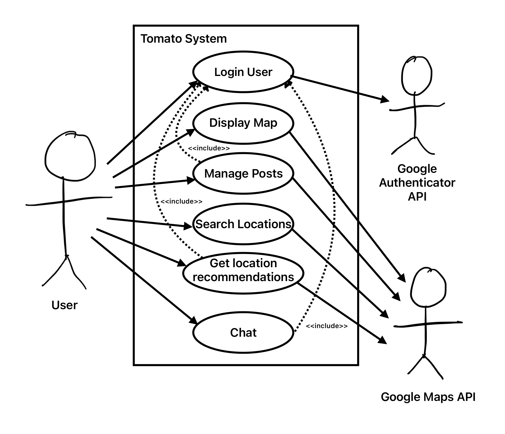
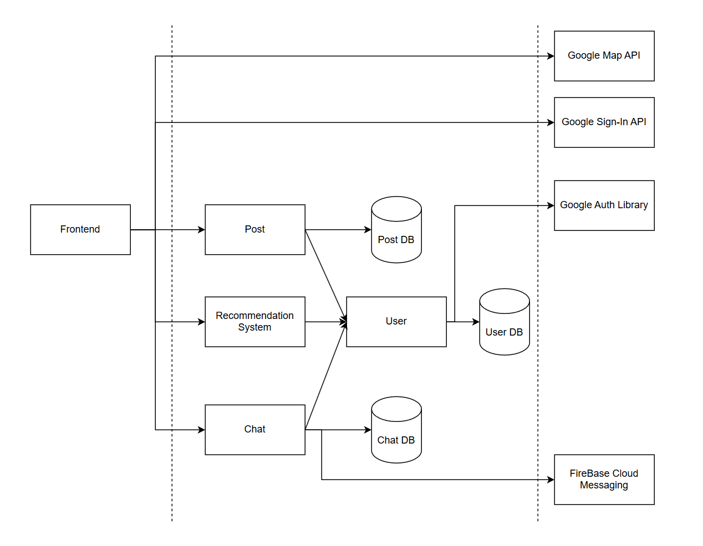
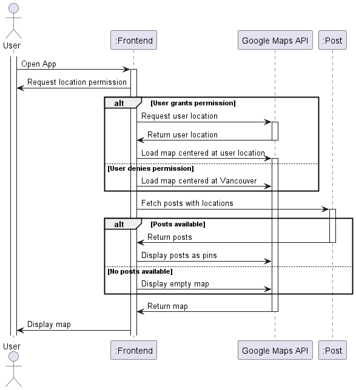
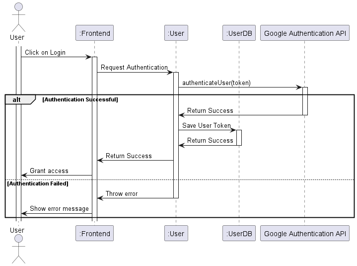
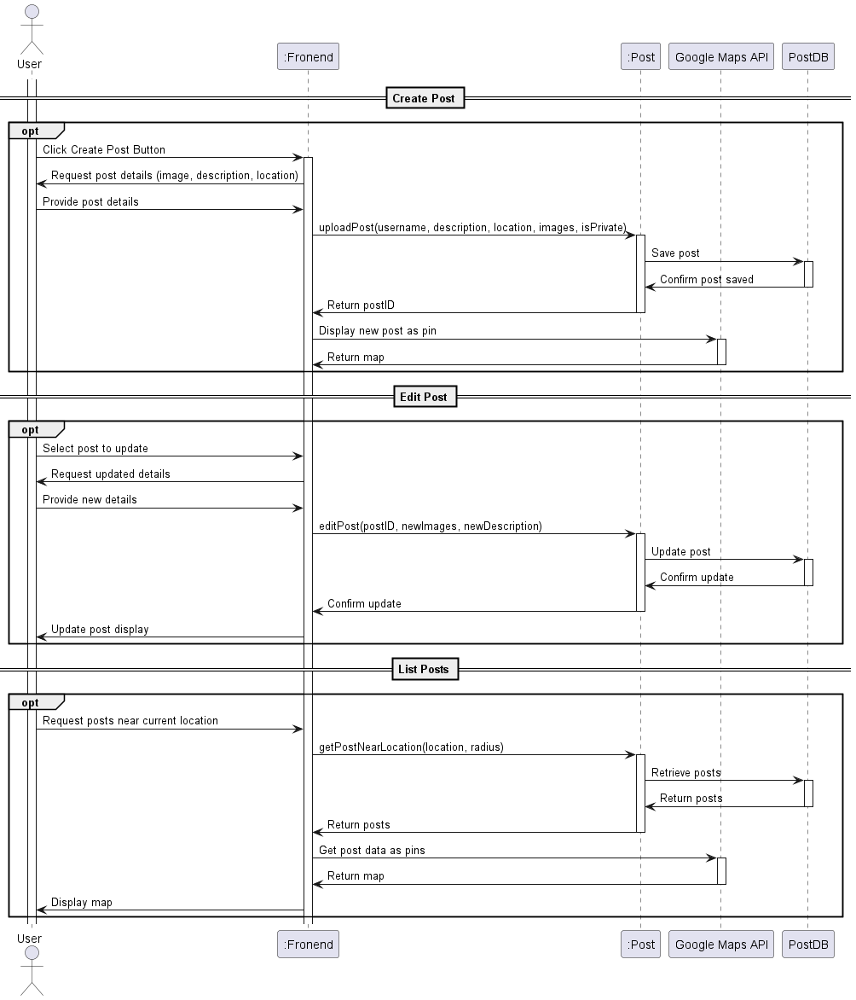
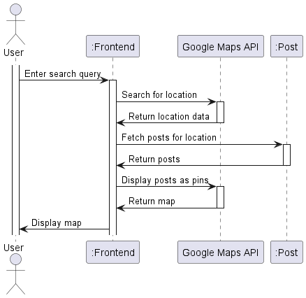
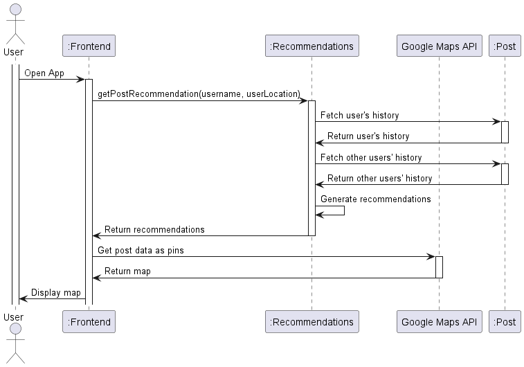

# M3 - Requirements and Design

## 1. Change History
<!-- Leave blank for M3 -->

## 2. Project Description
Our target audiences are young people who like to travel and take photos. Such users typically will have a large amount of photos compiled chronologically in a photo app i.e. Google Photos, but without much sense of where they were taken. As such, our solution involves viewing and navigating around a map with pins that show the user’s past images, as well as small optional notes that they can add. Furthermore, users can receive recommendations for future travel locations based on their travel history. When viewing other people's notes, they can optionally chat with the person taking a photo to ask about the logistics of traveling there (i.e. do they accept cash? How much equipment did you bring?)
It allows people to keep a history of all the places they have traveled to and add notes to each place, which act as travel advisories for others. Users will also receive suggestions on some interesting travel locations based on all user history (recommendation system algorithm). Since the app also allows a chatting feature, people can contact other users who have traveled there for advice easily.	

## 3. Requirements Specification
### **3.1. Use-Case Diagram**

### **3.2. Actors Description**
1. **User**: The application’s customer who will be creating and deleting posts,  using the chat and viewing other user’s posts on the app.
2. **Google Maps API**: The API the app will call in order to display the interactive maps of each user.
3. **Google Authentication API**: The API the app will call in order to sign a user in.

### **3.3. Functional Requirements**
<a name="fr1"></a>

1. **Display an interactive map** 
    - **Overview**:
        1. Shows the map at the user’s general location
        2. Displays posted pictures as pins on the map
    
    - **Detailed Flow for Each Independent Scenario**: 
        1. **Shows the map at the user’s general location**:
            - **Description**: Opens the map to the user’s general location when the app starts
            - **Primary actor(s)**: User, Google Maps API 
            - **Main success scenario**:
                1\. User allows the app to access their location
                2\. App successfully connects to Google Maps API
                3\. App opens the map to the user’s general location
            - **Failure scenario(s)**:
                - 1a. User has not allowed the app to see their location
                    - 1a1. Makes a request to the user to allow the app to access their location
                    - 1a2. If users agrees, the map will open showing the user’s general location
                    - 1a3. Otherwise opens the map to Vancouver as opposed to their current location
                - 2a. Google Maps API is not available
                    - 2a1. A toast will appear telling the user that Google Maps is unavailable and to try again later

        2. **Displays posted pictures as pins on the map**
            - **Description**: Displays pictures posted by the user and others users as pins on the map
            - **Primary actor(s)**: User, Google Maps API 
            - **Main success scenario**:
                1. App displays all the posts as pins on the map
                2. App allows the users to scroll to different areas and view more posts
            - **Failure scenario(s)**:
                - 1a. Unable to retrieve posts
                    - 1a1. If the user is yet to post anything, the map opens as is with no pins
                    - 1a2. Else if the user’s posts were not able to retrieved from the database, a toast will appear telling the user that the posts were unable to be retrieved and to try again later

2. **Authenticate User**
    - **Overview**:
        1. Authenticates the user in the app
    
    - **Detailed Flow for Each Independent Scenario**: 
        1. **Authenticates the user in the app**:
            - **Description**: Authenticates the user in the app using the Google Authenticator API
            - **Primary actor(s)**: User, Google Authenticator API
            - **Main success scenario**:
                1. User opens the app
                2. App prompts user to sign in using their Google Account
                3. User enters their account information and signs in
                4. App continues as normal
            - **Failure scenario(s)**:
                - 3a. User is unable to login
                    - 3a1. A toast appears telling the user they were unable to login, along with the reason why and to try again
                    - 3a2. User can try again later after fixing the problem
 
3. **Manage Posts**
    - **Overview**:
        1. Create Posts
        2. Delete Posts
        3. Update Posts
        4. View Posts
         
    
    - **Detailed Flow for Each Independent Scenario**: 
        1. **Create Posts**:
            - **Description**: User is able to create a post with a picture and a description and add it as a pin to their map
            - **Primary actor(s)**: User, Google Maps API 
            - **Main success scenario**:
                1. User clicks on the Create Post button on their screen
                2. User adds their picture and description to post and sets the location and selects either public or private
                3. User clicks on the Create button after filling in the fields
                4. User confirms that they want to create the post
                5. App shows the newly created post as a pin on the map
            - **Failure scenario(s)**:
                - 2a. Could not access the user’s gallery
                    - 2a1. Makes a request to the user to allow the app to access their photos
                    - 2a2. If users agrees, the other steps will carry on as normal
                    - 2a3. Otherwise a toast will appear telling the user that it cannot add a picture without gallery permissions
                - 5a. Post could not be created
                    - 5a1. A toast will appear telling the user that a post was unable to created at this time along with the reason why

        2. **Delete Posts**
            - **Description**: Allows user to delete posts from their map that they no longer want to see
            - **Primary actor(s)**: User, Google Maps API 
            - **Main success scenario**:
                1. User clicks on the pin of post they want to delete
                2. User clicks on the Delete icon
                3. User confirms that they want to delete the post
                4. App removes the delete post as a pin on the map 
            - **Failure scenario(s)**:
                - 1a. Post could not be fetched
                    - 1a1. A toast will appear telling the user that the post was unable to retrieved at this time along with the reason why
                - 5a. Post could not be deleted
                    - 5a1. A toast will appear telling the user that the post was unable to delete at this time along with the reason why

        3. **Update Posts**:
            - **Description**: User is able to update an existing post by changing the picture or description
            - **Primary actor(s)**: User, Google Maps API 
            - **Main success scenario**:
                1. User clicks on the pin of post they want to update
                2. User clicks on the Update button
                3. User changes what they want about the post
                4. User clicks on the Update button after filling in the desired fields
                5. User confirms that they want to update the post
                6. App shows the newly updated post on the map
            - **Failure scenario(s)**:
                - 1a. Post could not be fetched
                    - 1a1. A toast will appear telling the user that the post was unable to retrieved at this time along with the reason why
                - 3a. Could not access the user’s gallery
                    - 3a1. Makes a request to the user to allow the app to access their photos
                    - 3a2. If users agrees, the other steps will carry on as normal
                    - 3a3. Otherwise a toast will appear telling the user that it cannot add a picture without gallery permissions
                - 6a. Post could not be updated
                    - 6a1. A toast will appear telling the user that the post was unable to updated at this time along with the reason why

        4. **View Posts**:
            - **Description**: User is able to view an existing post
            - **Primary actor(s)**: User, Google Maps API 
            - **Main success scenario**:
                1. User clicks on the pin of post they want to view
                2. User is able to see the post and the description of the post
            - **Failure scenario(s)**:
                - 2a. Post could not be fetched
                    - 2a1. A toast will appear telling the user that the post was unable to retrieved at this time along with the reason why

4. **Search Locations**
    - **Overview**:
        1. Search Locations
    
    - **Detailed Flow for Each Independent Scenario**: 
        1. **Search Locations**:
            - **Description**: Allows the user to search specific locations to see the posts from there
            - **Primary actor(s)**: User, Google Maps API
            - **Main success scenario**:
                1. User goes to the search bar at the top of the screen
                2. User inputs the location they want to see
                3. User clicks on the Search icon
                4. App displays all the available posts in that area on the map
            - **Failure scenario(s)**:
                - 4a. Posts could not be fetched
                    - 4a1. A toast will appear telling the user that the post was unable to retrieved at this time along with the reason why

5. **Suggests Locations**
    - **Overview**:
        1. Suggests travel locations for the user
    
    - **Detailed Flow for Each Independent Scenario**: 
        1. **Suggests travel locations for the user**:
            - **Description**: Shows the user similar places to go to based on their previous travels and searches
            - **Primary actor(s)**: User, Google Maps API
            - **Main success scenario**:
                1. User clicks on the Suggest a Location button
                2. User specifies whether it should be nearby or anywhere
                3. App returns a popup of a description of the suggested location
                4. User clicks away from the popup
                5. App navigates to the location on the map and shows posts from users who have been there
            - **Failure scenario(s)**:
                - 5a. Posts could not be fetched
                    - 5a1. A toast will appear telling the user that the post was unable to retrieved at this time along with the reason why

6. **Chat with users**
    - **Overview**:
        1. Start new chat from post
        2. Start new chat from Chat activity
        3. View existing chat         
    
    - **Detailed Flow for Each Independent Scenario**: 
        1. **Start new chat from post**:
            - **Description**: Allows user to start a new chat from another user’s post
            - **Primary actor(s)**: User, Google Maps API 
            - **Main success scenario**:
                1. User clicks on the pin of another user’s post
                2. User clicks on the Chat button
                3. App creates a new chat room with both users in it
                4. User sends a message to the other user
            - **Failure scenario(s)**:
                - 1a. Post could not be fetched
                    - 1a1. A toast will appear telling the user that the post was unable to retrieved at this time along with the reason why
                - 3a. Unable to create a new chat room
                    - 3a1. A toast will appear telling the user that a new chat room was unable to created at this time along with the reason why
                - 4a. Unable to send message
                    - 4a1. A toast will appear telling the user that a message was unable to sent at this time along with the reason why

        2. **Start new chat from Chat activity**
            - **Description**: Allows user to start a new chat with a user from the Chat activity page
            - **Primary actor(s)**: User
            - **Main success scenario**:
                1. User clicks on the Chat button on the screen
                2. User clicks on the Start New Chat button on the screen
                3. App displays all the users as well as a search bar
                4. User selects the user to chat with
                5. App creates a new chat room with both users in it
                6. User sends a message to the other users
            - **Failure scenario(s)**:
                - 3a. Unable to fetch users
                    - 3a1. A toast will appear telling the user that a list of users was not able to retrieved at this time along with the reason why
                - 5a. Unable to create a new chat room
                    - 5a1. A toast will appear telling the user that a new chat room was unable to created at this time along with the reason why
                - 6a. Unable to send message
                    - 6a1. A toast will appear telling the user that a message was unable to sent at this time along with the reason why


        3. **View existing chat**:
            - **Description**: Allows the user to view chats that they are apart of
            - **Primary actor(s)**: User
            - **Main success scenario**:
                1. User clicks on the Chat button on the screen
                2. App presents all their chats on the screen
                3. User clicks on the chat they want to view
                4. App opens that chat with all its messages
            - **Failure scenario(s)**:
                - 2a. Unable to fetch chats
                    - 2a1. A toast will appear telling the user that a list of chats was not able to retrieved at this time along with the reason why
                - 4a. Unable to fetch messages
                    - 4a1. A toast will appear telling the user that the chat’s messages were not able to retrieved at this time along with the reason why

### **3.4. Non-Functional Requirements**
<a name="nfr1"></a>

1. **No more than 10 pins on the screen at any time**
    - **Description**: No more than 10 pins will be shown on a user’s map at any given time.
    - **Justification**: This allows for there to be less clutter on the screen if the user posts many images.
2. **At most 4 clicks to access any of the use cases**
    - **Description**: No more than 4 clicks are necessary to access any of the main use cases
    - **Justification**: This allows for the user to navigate the app easily and makes every use case within a comfortable reach from the user.

## 4. Designs Specification
### **4.1. Main Components**
1. **User**
    - **Purpose**: Manages user authentication and user data.

    - **Interfaces**: 
        1. `public static bool authenticateUser (String token)`
            - **Purpose**: Verifies user's Google ID token. Returns true If user is successfully authenticated, otherwise returns false.

2. **Post**
    - **Purpose**: Manages posts data and allows posts retrieval based on location range or user's map view.
    - **Interfaces**: 
        1. `public static String uploadPost (String userID, String description, Location location, List<Image> images, bool isPrivate)`
            - **Purpose**: upload post where user explicitly provides the locations associated to the images. If isPrivate is True, the post is only visible to the user, otherwise it's visible to the public

        2. `public static String uploadImages (String userID, List<Image> images, bool private)`
            - **Purpose**: upload image-only posts where the location data is automatically parsed from the image. 

        3. `public static bool editPost (String postID, List<Image> newImages, String newDescription)`
            - **Purpose**: edit a post.

        4. `public static List<Post> getPostNearLocation (Location location, double radius)`
            - **Purpose**: retrieve all public posts that are centered at "location" and are within "radius" meter from it.

        5. `public static List<Post> getPostFromMapView (MapBoundary mapBoundary)`
            - **Purpose**: retrieve all public posts based on the given map boundary, which includes min & max latitude and longtitude of the given map's view.

3. **Chat**
    - **Purpose**: Manages chat data and sends user a notification on new message.

    - **Interfaces**: 
        1. `public static void sendMessage (String senderUserID, String receiverUserID String message)`
            - **Purpose**: Send message.
        2. `public static List<ChatMessage> getMessageHistory(String chatID)`
            - **Purpose**: Retrieve chat history for a particular chat.

4. **Recommendation System**
    - **Purpose**: Recommend posts based on user's history or current trend.

    - **Interfaces**: 
        1. `public static List<Post> getPostRecommendation(String userID, Location userLocation)`
            - **Purpose**: Recommend posts based on user's travel history and user's current location. Recommendation system is made as its own component for better separation of concern in developing recommendation system algorithm.


### **4.2. Databases**
1. **UserDB**
    - **Purpose**: Stores user's credentials
2. **PostDB**
    - **Purpose**: Stores database of posts, where a post represents a list of images associated to a location with an optional description.
3. **ChatDB**
    - **Purpose**: Stores chat messages.

### **4.3. External Modules**
1. **Google Sign-In API** 
    - **Purpose**: To allow user to sign in with google in the frontend.

2. **Google Auth Library** 
    - **Purpose**: To authenticate user in the backend, by verifying the token generated by Google Sign-In API.
    - **Interfaces**: 
        1.  `POST https:/oauth2.googleapis.com/tokeninfo`
        - **Purpose**:
        To authenticate user given Google's token ID.

3. **Google Map API** 
    - **Purpose**: Render map with posts pinpointed on it.
4. **FireBase Cloud Messaging** 
    - **Purpose**: Notify users of new chat messages.


### **4.4. Frameworks**
1. **AWS EC2**
    - **Purpose**: Cloud Provider
    - **Reason**: EC2 has free trial and there is a clear setup tutorial provided by the teaching team.  
2. **ExpressJs**
    - **Purpose**: Backend  
    - **Reason**: ExpressJS is simple to use and everyone in the team is familiar with it.


### **4.5. Dependencies Diagram**


### **4.6. Functional Requirements Sequence Diagram**
1. [**Display an Interactive Map**](#fr1)\

2. [**Authenticate User**](#fr2)\

3. [**Manage Posts**](#fr3)\

4. [**Search by Location**](#fr4)\

5. [**Suggest Locations**](#fr5)\

6. [**Chat with Users**](#fr6)\


### **4.7. Non-Functional Requirements Design**
1. [**No more than 10 pins on the screen at any time**](#nfr1)
    - **Validation**: Both the suggestion algorithm and the user's own posts will be given in priority stacks based on on-screen proximity to each other, and hence the number of pins and how crowded they are can be managed.
2. [**At most 4 clicks to access any of the use cases**](#nfr2)
    - **Validation**: UI will be designed such that the central functionality of the app (i.e. the map) will have navigation to each use case so that it will not become cumbersome to use. The map will be the home page of the app, which already eliminates one click before most of the functionality.


### **4.8. Main Project Complexity Design**
**Suggestion Algorithm**
- **Description**: The suggestion algorithm will suggest new locations with corresponding pins with pictures of those locations appearing on the map, if the suggestion feature is enabled.
- **Why complex?**: The suggestion algorithm will work on centroids, determined using K-means clustering, showing general areas where the user has been, and subsequently suggest other centroids that the user has not been to, based on "popularity" of the centroid and proximity to the user.
- **Design**:
    - **Input**: User's past visited locations, popularity of non-visited locations, proximity to user's past locations
    - **Output**: A list of pins corresponding to recommended locations
    - **Main computational logic**: Firstly to cluster the user's existing memories and store the location of those centroids. Subsequently, the total information of other users will be used to generate more centroids, whose proximity to the user will be calculated and ranked before suggesting.
    - **Pseudo-code**: 
        ```
        FUNCTION suggest_locations(past_memories, current_location, radius_of_interest, num_clusters, novelty_weight, proximity_weight):
            // Step 1: Cluster past memories
            clusters = CLUSTER(past_memories, num_clusters)  // e.g., using K-Means
            centroids = CALCULATE_CENTROIDS(clusters)

            // Step 2: Generate candidate locations
            candidate_locations = GENERATE_CANDIDATES(current_location, radius_of_interest)

            // Step 3: Filter unexplored locations
            unexplored_locations = []
            FOR location IN candidate_locations:
                IF IS_UNEXPLORED(location, centroids, min_distance=20):
                    unexplored_locations.APPEND(location)

            // Step 4: Rank locations by novelty and proximity
            ranked_locations = []
            FOR location IN unexplored_locations:
                novelty_score = CALCULATE_NOVELTY_SCORE(location, past_memories)
                proximity_score = CALCULATE_PROXIMITY_SCORE(location, current_location)
                final_score = (novelty_weight * novelty_score) + (proximity_weight * proximity_score)
                ranked_locations.APPEND((location, final_score))

            // Step 5: Sort and return top suggestions
            ranked_locations.SORT_BY_SCORE(final_score, descending=True)
            top_suggestions = ranked_locations.TAKE(3)  // Top 3 suggestions
            RETURN top_suggestions

        FUNCTION CLUSTER(past_memories, num_clusters):
            // Use a clustering algorithm (e.g., K-Means) to group past memories
            RETURN clusters

        FUNCTION CALCULATE_CENTROIDS(clusters):
            // Calculate the centroid (average latitude and longitude) of each cluster
            RETURN centroids

        FUNCTION GENERATE_CANDIDATES(current_location, radius_of_interest):
            // Generate candidate locations within the radius of interest
            RETURN candidate_locations

        FUNCTION IS_UNEXPLORED(location, centroids, min_distance):
            // Check if the location is far enough from all centroids
            FOR centroid IN centroids:
                IF DISTANCE(location, centroid) < min_distance:
                    RETURN False
            RETURN True

        FUNCTION CALCULATE_NOVELTY_SCORE(location, past_memories):
            // Calculate the average distance from the location to all past memories
            total_distance = 0
            FOR memory IN past_memories:
                total_distance += DISTANCE(location, memory)
            RETURN total_distance / LENGTH(past_memories)

        FUNCTION CALCULATE_PROXIMITY_SCORE(location, current_location):
            // Calculate the inverse of the distance from the location to the current location
            distance = DISTANCE(location, current_location)
            RETURN 1 / (distance + 1e-6)  // Avoid division by zero

        FUNCTION DISTANCE(location1, location2):
            // Calculate the geodesic distance between two (latitude, longitude) pairs
            RETURN GEODESIC_DISTANCE(location1, location2)
        
        ```


## 5. Contributions
- Rumbi Chinamo: Functional Requirements
- Bryan Tanady: Main components and interface, Presentation Slides
- Xuan Tung Luu: Review, Components diagram, Presentation Slides
- James: Sequence Diagrams, Non-Functional Requirements Design and Complex Design


